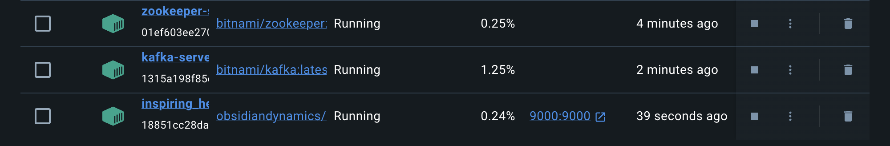
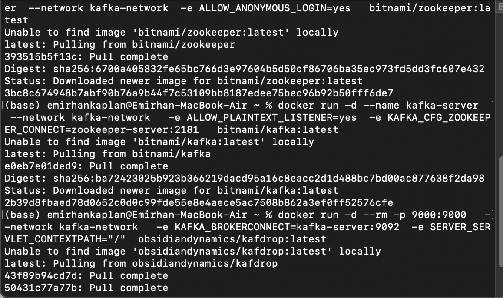
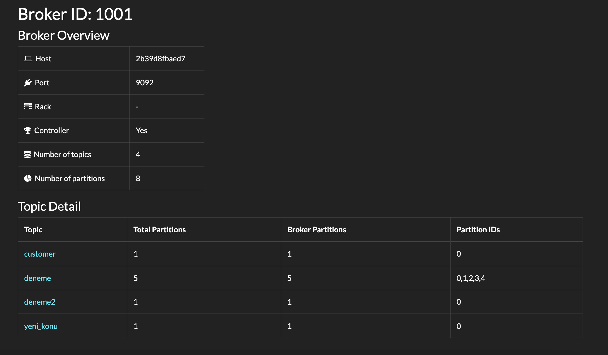
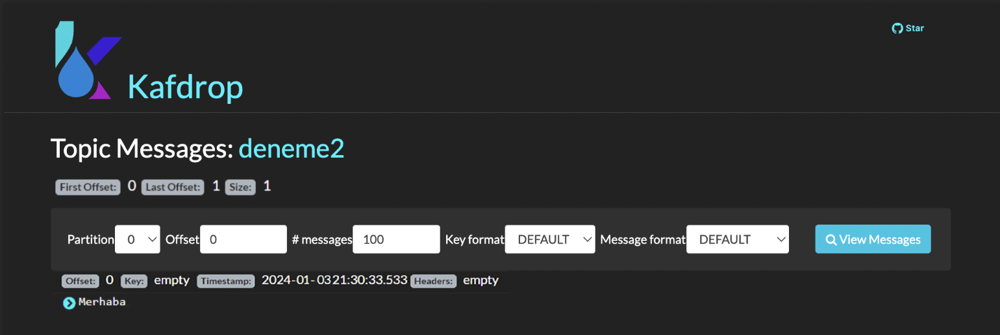

# Apache Kafka with Docker — Java Producer & Consumer

A hands-on Apache Kafka lab: a single Kafka broker and ZooKeeper running in Docker, monitored with **Kafdrop**, plus plain-Java producer and consumer examples.

## 📦 What's inside

| File | Description |
| --- | --- |
| `Kafka/src/main/java/com/mycompany/kafka/KafkaProducerExample.java` | Sends `"Merhaba Kafka!"` to the topic `deneme2` |
| `Kafka/src/main/java/com/mycompany/kafka/KafkaConsumerExample.java` | Subscribes to `deneme2` and prints every record |
| `Kafka/src/main/java/com/mycompany/kafka/Kafka.java` | Produces a `Student` record (id → name), then consumes the topic |
| `Kafka/src/main/java/com/mycompany/kafka/Student.java` | Simple POJO used as the message payload |
| `Kafka/docker-compose.yml` | Kafka + ZooKeeper (Bitnami images) on an external `kafka-network` |

## 🧰 Tech stack

Java 8 · Maven · kafka-clients 2.8.1 · Docker · Kafka & ZooKeeper · Kafdrop

## 🚀 Running it

1. **Start ZooKeeper, Kafka and Kafdrop** on a shared Docker network:

   ```bash
   docker network create kafka-network

   docker run -d --name zookeeper-server --network kafka-network \
     -e ALLOW_ANONYMOUS_LOGIN=yes bitnami/zookeeper:latest

   docker run -d --name kafka-server --network kafka-network \
     -e ALLOW_PLAINTEXT_LISTENER=yes \
     -e KAFKA_CFG_ZOOKEEPER_CONNECT=zookeeper-server:2181 \
     bitnami/kafka:latest

   docker run -d --rm -p 9000:9000 --network kafka-network \
     -e KAFKA_BROKERCONNECT=kafka-server:9092 \
     -e SERVER_SERVLET_CONTEXTPATH="/" \
     obsidiandynamics/kafdrop:latest
   ```

   > ℹ️ Bitnami moved its free images to `bitnamilegacy/*` in 2025 — if the pulls above fail, use `bitnamilegacy/zookeeper` and `bitnamilegacy/kafka` instead.

2. **Point the clients at your broker.** The examples use `bootstrap.servers = 172.18.0.3` (the broker's IP on the Docker network); change it to match your setup.

3. **Run the producer and the consumer:**

   ```bash
   cd Kafka
   mvn compile exec:java -Dexec.mainClass=com.mycompany.kafka.KafkaProducerExample
   mvn compile exec:java -Dexec.mainClass=com.mycompany.kafka.KafkaConsumerExample
   ```

4. **Inspect topics and messages** in Kafdrop at <http://localhost:9000>.

## 📸 Screenshots

**Containers running in Docker**



**Starting the containers**



**Kafdrop — broker overview and topics**



**Kafdrop — the message in `deneme2`**


